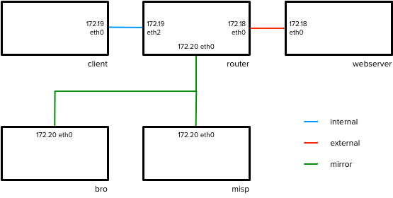

# docker-soc-demonstrator

## Introduction

A test, **non-production** SOC demonstrator, intended to track the lifecycle of an event. 

## Components

The current containers used by this demonstrator are:

- client
- webserver
- router
- bro
- misp-web
- misp-db

`misp-web` and `misp-db` are used from the misp-docker (XME edition) repo, part of the official MISP project, which is included as a submodule.

## Networks

Three internal docker networks are used:

- internal
- external
- mirror

Each container is configured to belong to a specific set of these: 

- client: `internal` only
- webserver: `external` only
- bro: `mirror` only
- router: `internal`:`external`:`mirror`
- misp-web: `mirror` only
- misp-db: `mirror` only

The router is then configured to route traffic between the client and webserver, mirroring the consequent packets to the bro node via the mirror network.

A network diagram showing the configuration is given below


## Usage

### Quickstart

- Clone repo
- Inside repo, run `git submodule update --init` to pull in dependencies
- Run `./build.sh`
- Build should take a few minutes
- Following build, containers will be automatically started.
- Visit `127.0.0.1:8040` to see MISP login page
  - Log in with `admin@admin.test:admin` and change password
- Visit `127.0.0.1:8031/demonstrator/` to see contents of webserver
- Use, for example, `docker exec -it CONTAINER bash` to access a particular container. They are designed to continue running even if a service is not live.

#### Troubleshooting

- If containers don't start properly, `Ctrl-C` to stop containers, and re-run `docker-compose up` (particularly if you see error messages like "could not connect to database")
- Make sure you're in the `docker-soc-demonstrator` directory proper - there is another `docker-compose.yml` file in the `misp-docker` subdirectory (the XME misp-docker repo), but we override this with different network settings to make our cluster work.

### Demo workflow

An initial demo could include showing that network traffic, where one endpoint is identified in a MISP event, can 

1. be tracked with bro
2. be identified as matching intelligence by bro for further action

Steps to follow

- After setting up admin account on MISP, note on front page that no events exist
- Visit user page and flag authentication key for later use
- on `bro`, visit `/opt/bro/logs/current/` and look in `conn.log` and `http.log`- should see connection attempt from `bro` to `misp-web` trying to fetch intel. This will not be working. This is a good time to note that different types of traffic will have specific logs autogenerated (if you have the relevant scripts enabled)
- copy auth key to `/files/simplemisp.sh`
- Note in `conn.log` that the connections to misp-web continue. You can also see in `http.log` that these should have switched from `403` to `200` [CHECK]
- Should now be able to see contents of `/files/feeds/testdata.txt` - just file headings
- On `client`, check that webserver is accessible and issue `curl http://webserver/demonstrator/` which should give a "Hello world!"
- on `bro`, should note presence of `172.20.19.14` in conn.log
- in MISP UI (`127.0.0.1:8040`), add an event with "Event info -> Demo"  and add an attribute:
  - Category: Network activity
  - Type: ip-dst
  - Value: 172.20.19.14
  - Check "for Intrusion Detection System"
- From sidebar, issue "Publish Event" -> "YES"
- on `bro`, check that `/files/feeds/testdata.txt` now populates with this data (takes > 5 secs)
- on `client`, rerun `curl http://webserver/demonstrator/`
- on `bro`, check that `172.20.19.14` again appears in `conn.log`
- on `bro`, there should also now be an `intel.log` file with relevant matches.


### Detailed notes

- Build docker images with docker-compose

```
docker-compose build
```

This builds a new image for each component. The demonstrator is intended to reflect the WG deployment [documentation](http://wlcg-soc-wg-doc.web.cern.ch/wlcg-soc-wg-doc/), so each container starts from a base centos:7 image - this step can therefore take a few minutes

- Bring up containers in the background

```
docker-compose up -d
```


- Check that `client` can talk to `webserver` via `ping` or otherwise

```
docker exec client ping [WEBSERVER_IP]
```

- Access some data from `webserver` on `client`, eg

```
docker exec client curl -s http://[WEBSERVER_IP]/demonstrator/
```

- Check that this works OK
- On `bro`, check that the contents of `/opt/bro/logs/current/` looks something like this:

```
capture_loss.log   files.log  known_hosts.log     packet_filter.log  stderr.log
communication.log  http.log   known_services.log  software.log       stdout.log
conn.log           intel.log  loaded_scripts.log  stats.log
```

- If the IP address of `client` or `webserver` matches `/files/testdata.txt`, you should see a populated `intel.log` file.

```
docker exec bro grep [WEBSERVER_IP] /opt/bro/logs/current/intel.log
```

- Watch live traffic

```
docker exec bro tail -f /opt/bro/logs/current/conn.log
```

On client

```
docker exec curl [WEBSERVER_IP]
```

You should see `conn.log` populating with traffic.


